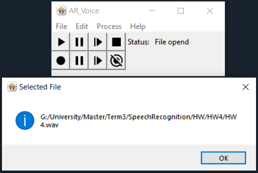
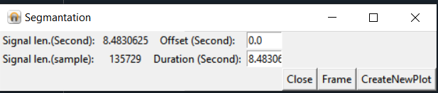
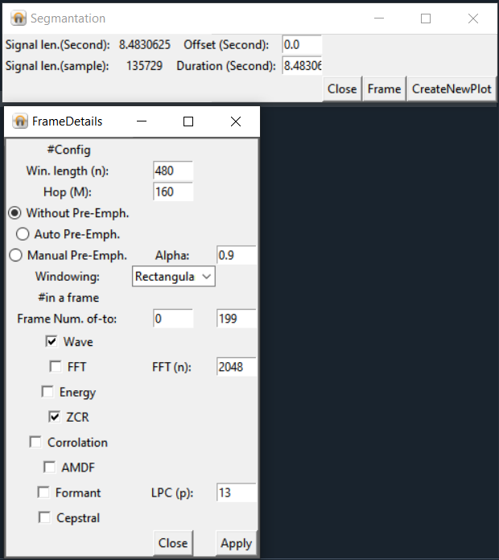
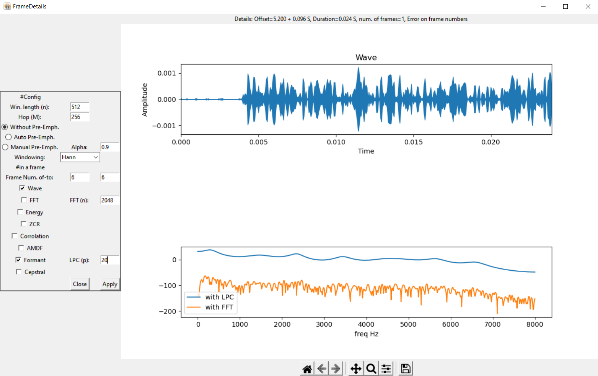

# Speech_Processing_App_v2.0
you must to run setup.py for run this code  
<b>Note: This code must run on Windows because I used Windows MCI libraries, If you want to run it on others operating system, you must modify the files in the sys_file folder <b />  
You can load, record, save and etc. wav files and also apply many feature extraction commands (such as Spectrum, ZCR, FFT, PreEmphasis, windowing, etc.).  

<h1>Some features </h1>
  <h2>Open a file</h2>
  
  
  <h2>Create a data frame with a specific offset and duration</h2>
  
  
  <h2>If you select "Frame" in the image above. You can use the below features</h2>
  After setting these features, you can apply them with the "Apply" button  
  
  
  <h2>Plot formant with LPC and FFT</h2>
  
  
Features of this app:  
<ul>
  <li>Framming
  <li>Windowing
  <li>Manual Pre-Emphasis
  <li>Auto-Emphasis
  <li>Show wave
  <li>Show FFT
  <li>Show Energy
  <li>Show ZCR (zero cross rate)
  <li>Corrolation
  <li>AMDF
  <li>Formant
  <li>Cepstral
  </ul>
  
if you need to help, use this email: a.a.rahmati.r.r@gamil.com
  
